# ULPF Prototype Plan -- 1 Week Build

> **Goal**: Build a working proof-of-concept that demonstrates the full ULPF architecture in a simplified form. This prototype will be shown at the internal hackathon along with the PPT for evaluation and grand finale selection.

---

## What the Prototype Will Prove

By the end of this week, we will have a working system that:

1. Accepts any log via an HTTP API
2. Automatically identifies which device sent the log using confidence scoring
3. If the log is unknown or ambiguous, it gets quarantined (not guessed)
4. If the log is recognized, it gets parsed using the correct versioned parser
5. Parsed fields are validated, then normalized to OCSF schema
6. Every normalized field can be traced back to the exact raw text it came from
7. The full event with provenance and lineage is stored in Elasticsearch
8. Kibana dashboards show everything in real-time
9. Unknown quarantined logs are clustered, sent to Gemma 4, which generates a candidate parser
10. After human approval, the new parser activates and quarantined logs get parsed

That is the full story. Both loops working.

---

## What We Are NOT Building in the Prototype

- No Kafka (events flow directly through functions in one Node.js app)
- No MinIO (raw events stored as files on disk or in Elasticsearch)
- No Syslog receiver (HTTP API only)
- No file-tail watcher
- No GeoIP enrichment
- No anomaly detection
- No replay architecture
- No duplicate detection
- No Docker Compose (run services locally, Dockerize only at the very end if time permits)
- Only 3 parsers (Cisco ASA, Fortinet FortiGate, Generic CEF), not 12

These features are part of the full solution and will be built in the grand finale if selected.

---

## Tech Stack (Prototype Only)

| What | Technology | Why |
|------|-----------|-----|
| Main app | Node.js with Express | One app, simple, M2/M3/M4 all know it |
| Language | JavaScript (ES modules) | Fast to write, team knows it |
| Database for events | Elasticsearch (run locally or via Docker) | Search + dashboards in one |
| Dashboards | Kibana (comes with Elasticsearch) | No frontend to build |
| AI model | Gemma 4 via Ollama (run locally) | One command to install and run |
| AI integration | Simple HTTP fetch to Ollama API | No SDK needed |
| Parser definitions | YAML files | Easy to read and write |
| Raw event storage | Local filesystem (JSON files in a folder) | Simplest possible |
| API testing | Postman or curl | Send test logs to the API |

### How to install prerequisites

**Elasticsearch + Kibana**: Download from elastic.co or run via Docker:
```bash
docker run -d --name elasticsearch -p 9200:9200 -e "discovery.type=single-node" -e "xpack.security.enabled=false" docker.elastic.co/elasticsearch/elasticsearch:8.15.0

docker run -d --name kibana -p 5601:5601 -e "ELASTICSEARCH_HOSTS=http://host.docker.internal:9200" docker.elastic.co/kibana/kibana:8.15.0
```

**Ollama + Gemma 4**: Download Ollama from ollama.com, then:
```bash
ollama pull gemma3:4b
```
(Use gemma3 4B if gemma4 is not yet available in Ollama. The API is the same.)

**Node.js**: Version 20 or higher.

---

## Prototype Architecture Diagram

```mermaid
flowchart TB
    subgraph User["You (Testing)"]
        CURL["Send logs via<br/>curl / Postman<br/>POST /api/logs"]
    end

    subgraph App["Node.js App (Single Express Server - port 3000)"]

        subgraph Receive["1. Receiver Module"]
            RCV["Receive raw log string<br/>Create event envelope:<br/>- Generate UUID<br/>- Compute SHA-256 hash<br/>- Record timestamp<br/>- Save raw to disk"]
        end

        subgraph Resolve["2. Source Resolver Module"]
            SIG["Check each parser's<br/>signature patterns<br/>against the raw log"]
            CONF["Calculate confidence<br/>score for each parser<br/>(signature + structure)"]
            DECIDE["Apply routing rules:<br/>score >= 0.90 and<br/>margin >= 0.05?"]
        end

        subgraph Parse["3. Parser Engine Module"]
            LOAD["Load YAML parser<br/>file for the<br/>winning parser"]
            EXTRACT["Apply regex rules<br/>from the YAML to<br/>extract fields"]
            PVAL["Parser Validation:<br/>Are required fields<br/>present and valid?"]
        end

        subgraph Normalize["4. Normalizer Module"]
            MAP["Map parsed fields to<br/>OCSF field names using<br/>the YAML mapping rules"]
            LINEAGE["Record field lineage:<br/>for each normalized field,<br/>save which raw text and<br/>which regex produced it"]
            SVAL["Schema Validation:<br/>Does the OCSF output<br/>have all required fields<br/>with correct types?"]
        end

        subgraph ExportMod["5. Export Module"]
            ESWRITE["Write the complete<br/>event envelope to<br/>Elasticsearch"]
        end

        subgraph ErrorPath["Error Handling"]
            QUAR["Quarantine Store<br/>(unknown/ambiguous<br/>logs saved to<br/>quarantine ES index)"]
            DEAD["Dead-Letter Store<br/>(known source but<br/>parsing failed,<br/>saved to dead-letter<br/>ES index)"]
        end
    end

    subgraph Intelligence["Intelligence Plane (Python or Node.js)"]
        FINGER["Fingerprint unknown<br/>logs: replace IPs,<br/>ports, timestamps<br/>with placeholders"]
        CLUSTER["Group by fingerprint<br/>Pick representative<br/>samples"]
        GEMMA["Send samples to<br/>Gemma 4 via Ollama<br/>API (localhost:11434)"]
        CANDIDATE["Gemma 4 returns<br/>suggested fields and<br/>regex patterns"]
        TEST["Test candidate parser<br/>against samples<br/>(positive + negative)"]
        APPROVE["Human approves via<br/>API call or button"]
        ACTIVATE["Save as new YAML<br/>parser file, reload<br/>parser list"]
    end

    subgraph External["External Services (Running Locally)"]
        ES["Elasticsearch<br/>localhost:9200"]
        KIB["Kibana<br/>localhost:5601"]
        OLLAMA["Ollama + Gemma 4<br/>localhost:11434"]
    end

    %% Main flow
    CURL --> RCV
    RCV --> SIG
    SIG --> CONF
    CONF --> DECIDE
    DECIDE -->|"clear winner"| LOAD
    DECIDE -->|"unknown /<br/>ambiguous"| QUAR
    LOAD --> EXTRACT
    EXTRACT --> PVAL
    PVAL -->|"PASS"| MAP
    PVAL -->|"FAIL"| DEAD
    MAP --> LINEAGE
    LINEAGE --> SVAL
    SVAL -->|"PASS"| ESWRITE
    SVAL -->|"FAIL"| DEAD

    %% Intelligence flow
    QUAR --> FINGER
    FINGER --> CLUSTER
    CLUSTER --> GEMMA
    GEMMA --> CANDIDATE
    CANDIDATE --> TEST
    TEST -->|"pass"| APPROVE
    APPROVE --> ACTIVATE

    %% External connections
    ESWRITE --> ES
    QUAR --> ES
    DEAD --> ES
    ES --> KIB
    GEMMA -.-> OLLAMA

    %% Styling
    style User fill:#2d3748,stroke:#4a5568,color:#e2e8f0
    style App fill:#1a365d,stroke:#2b6cb0,color:#bee3f8
    style Receive fill:#1a365d,stroke:#2b6cb0,color:#bee3f8
    style Resolve fill:#1a365d,stroke:#2b6cb0,color:#bee3f8
    style Parse fill:#1a365d,stroke:#2b6cb0,color:#bee3f8
    style Normalize fill:#1a365d,stroke:#2b6cb0,color:#bee3f8
    style ExportMod fill:#1a365d,stroke:#2b6cb0,color:#bee3f8
    style ErrorPath fill:#742a2a,stroke:#e53e3e,color:#fed7d7
    style Intelligence fill:#553c9a,stroke:#805ad5,color:#e9d8fd
    style External fill:#22543d,stroke:#38a169,color:#c6f6d5
```



---

## Project Folder Structure

Everyone works inside the same Node.js project. This is the folder layout:

```
SIH-26156/
├── package.json
├── server.js                    (Express app entry point - M2 creates this)
│
├── config/
│   ├── scoring.json             (confidence weights and thresholds - M1 creates)
│   └── schema.json              (OCSF required fields and types - M1 creates)
│
├── parsers/                     (YAML parser files - M1 creates)
│   ├── cisco_asa_v1.0.yaml
│   ├── fortinet_v1.0.yaml
│   └── generic_cef_v1.0.yaml
│
├── modules/
│   ├── receiver.js              (M2 builds)
│   ├── source-resolver.js       (M3 builds)
│   ├── parser-engine.js         (M3 builds)
│   ├── normalizer.js            (M4 builds)
│   ├── schema-validator.js      (M4 builds)
│   ├── provenance.js            (M4 builds)
│   ├── field-lineage.js         (M4 builds)
│   ├── exporter.js              (M2 builds)
│   └── intelligence.js          (M1 builds)
│
├── routes/
│   ├── logs.js                  (POST /api/logs - M2 builds)
│   ├── parsers.js               (GET/POST /api/parsers - M4 builds)
│   ├── events.js                (GET /api/events/:id/lineage - M4 builds)
│   ├── quarantine.js            (GET /api/quarantine - M4 builds)
│   ├── intelligence.js          (POST /api/intelligence/... - M1 builds)
│   └── health.js                (GET /api/health - M2 builds)
│
├── raw-events/                  (folder where raw logs are saved as JSON files)
├── quarantine/                  (folder for quarantined unknown logs)
├── dead-letter/                 (folder for failed processing logs)
│
├── test-logs/                   (sample logs for testing - M6 collects)
│   ├── cisco_asa/
│   ├── fortinet/
│   ├── cef/
│   └── unknown/
│
└── docs/
    ├── architecture.md          (M6 writes content, M5 designs)
    └── presentation.pptx        (M5 designs, M6 edits)
```

---

## How the Modules Connect (For All Team Members)

This is the flow of data through the code. Every team member should understand this.

```
1. User sends POST /api/logs with a raw log string in the body

2. server.js calls receiver.receive(rawLogString)
   Returns: eventEnvelope (with event_id, sha256 hash, raw payload, timestamp)

3. server.js calls sourceResolver.resolve(eventEnvelope)
   Returns: { parserId, confidence, evidence, status }
   status is one of: "RESOLVED", "AMBIGUOUS", "UNKNOWN"

4. If status is "UNKNOWN" or "AMBIGUOUS":
   -> Save to quarantine (Elasticsearch "ulpf-quarantine" index)
   -> Return response: { status: "quarantined", reason: "..." }
   -> Stop here for this event

5. If status is "RESOLVED":
   -> server.js calls parserEngine.parse(eventEnvelope, parserId)
   -> Returns: { parsedFields, validationStatus, errors }

6. If validationStatus is "FAIL":
   -> Save to dead-letter (Elasticsearch "ulpf-deadletter" index)
   -> Return response: { status: "dead-letter", reason: "..." }
   -> Stop here

7. If validationStatus is "PASS" or "PARTIAL":
   -> server.js calls normalizer.normalize(eventEnvelope, parsedFields, parserId)
   -> Returns: { normalizedFields, fieldLineage }

8. server.js calls schemaValidator.validate(normalizedFields)
   Returns: { valid: true/false, errors: [] }

9. If not valid:
   -> Save to dead-letter
   -> Stop here

10. If valid:
    -> Assemble the final complete event envelope
    -> server.js calls exporter.export(completeEvent)
    -> Writes to Elasticsearch "ulpf-events" index
    -> Return response: { status: "exported", event_id: "..." }
```

Every module is a simple JavaScript file that exports functions. They do NOT depend on Express or HTTP. They are pure logic. Only the `routes/` files deal with HTTP requests.

---

## Detailed Task Breakdown Per Team Member

---

### M2: Debashish -- Infrastructure + Receiver + Export

**What you are building**: The project skeleton, the HTTP server, the code that receives raw logs and creates event envelopes, the code that writes finished events to Elasticsearch, and the error storage (quarantine and dead-letter).

**Where to start**: Create the project from scratch on Day 1.

#### Day 1: Project Setup + Elasticsearch

1. Create the folder `ulpf-prototype/`
2. Run `npm init -y`
3. Install dependencies:
   ```bash
   npm install express cors yaml uuid @elastic/elasticsearch crypto-js
   ```
4. Create `server.js` with a basic Express app running on port 3000
5. Get Elasticsearch running locally (Docker command above or download from elastic.co)
6. Get Kibana running locally
7. Test that you can reach `http://localhost:9200` and `http://localhost:5601`
8. Push initial project to GitHub. Share the repo link with the team.

#### Day 2: Receiver Module

Build `modules/receiver.js`. This file exports one function:

```javascript
// receiver.js
// Input: raw log string (the text exactly as received)
// Output: event envelope object

function receive(rawLogString) {
  return {
    event_id: generateUUID(),
    content_fingerprint: sha256(rawLogString),
    received_at: new Date().toISOString(),
    raw: {
      immutable_payload: rawLogString,
      encoding: "utf-8",
      integrity_hash: "sha256:" + sha256(rawLogString)
    },
    transport: {
      receiver: "http_api",
      protocol: "http"
    },
    // These fields will be filled by later modules:
    source: null,
    parsed: null,
    normalized: null,
    extensions: {},
    provenance: [],
    field_lineage: {},
    processing_status: "RECEIVED",
    processing_state_history: ["RECEIVED"]
  };
}
```

Also: save the raw log as a JSON file in the `raw-events/` folder using the `event_id` as filename. This is our raw archive.

Build `routes/logs.js`:
```javascript
// POST /api/logs
// Body: { "raw": "the raw log text here" }
// This is the main entry point. It calls all modules in sequence.
```

Wire the route into `server.js`.

#### Day 3-4: Exporter Module + Error Storage

Build `modules/exporter.js`. This file exports functions to write to Elasticsearch:

```javascript
// exporter.js

async function exportEvent(completeEventEnvelope) {
  // Write to Elasticsearch index "ulpf-events"
}

async function quarantineEvent(eventEnvelope, reason) {
  // Write to Elasticsearch index "ulpf-quarantine"
}

async function deadLetterEvent(eventEnvelope, error) {
  // Write to Elasticsearch index "ulpf-deadletter"
}
```

Use the `@elastic/elasticsearch` npm package. Create the three indices with appropriate mappings.

Build `routes/health.js`:
```javascript
// GET /api/health
// Returns: { status: "ok", elasticsearch: "connected", parsers_loaded: 3 }
```

#### Day 5: Wire Everything Together

By now M3 and M4 have their modules ready. Wire the full pipeline in `routes/logs.js`:

```javascript
const event = receiver.receive(rawLog);
const resolution = sourceResolver.resolve(event);

if (resolution.status === "UNKNOWN" || resolution.status === "AMBIGUOUS") {
  await exporter.quarantineEvent(event, resolution);
  return res.json({ status: "quarantined" });
}

const parseResult = parserEngine.parse(event, resolution.parserId);

if (parseResult.validationStatus === "FAIL") {
  await exporter.deadLetterEvent(event, parseResult.errors);
  return res.json({ status: "dead-letter" });
}

const normResult = normalizer.normalize(event, parseResult, resolution.parserId);
const schemaCheck = schemaValidator.validate(normResult.normalizedFields);

if (!schemaCheck.valid) {
  await exporter.deadLetterEvent(event, schemaCheck.errors);
  return res.json({ status: "dead-letter" });
}

// Assemble complete event and export
const completeEvent = assembleEvent(event, resolution, parseResult, normResult);
await exporter.exportEvent(completeEvent);
return res.json({ status: "exported", event_id: event.event_id });
```

#### Day 6-7: Testing + Bug Fixes + Docker (if time)

Test with sample logs from `test-logs/`. Fix bugs. If time permits, create a simple Dockerfile for the Node.js app.

**By the end, Debashish should have**: A running Express server that accepts logs via HTTP, creates event envelopes with SHA-256 hashes, saves raw events to disk, writes processed events to Elasticsearch in the correct index (events, quarantine, or dead-letter), and a health check endpoint.

---

### M3: Shreyasi -- Source Resolver + Parser Engine

**What you are building**: The brain of the system. Two modules: one that looks at a raw log and figures out which parser to use (with confidence scoring), and one that actually runs the parser to extract fields from the log.

**Where to start**: Once M2 has the project on GitHub (Day 1), pull it and start building your modules.

#### Day 1-2: Source Resolver

Build `modules/source-resolver.js`. This file exports one function:

```javascript
// source-resolver.js
// Input: event envelope (with raw.immutable_payload)
// Output: { parserId, confidence, evidence, status }

function resolve(eventEnvelope) {
  const rawLog = eventEnvelope.raw.immutable_payload;

  // 1. Load all parser YAML files from parsers/ folder
  // 2. For each parser, calculate a confidence score:

  //    Signature score (weight 0.40):
  //    Does the raw log contain the parser's signature pattern?
  //    Example: Cisco ASA logs contain "%ASA-"
  //    If yes: score = 0.40, if no: score = 0.00

  //    Structural score (weight 0.35):
  //    Does the log structure match what the parser expects?
  //    Example: Fortinet logs are key=value pairs
  //    If yes: score = 0.35, if no: score = 0.00

  //    Metadata score (weight 0.25):
  //    Any additional hints? (for prototype, this can be simple keyword matching)
  //    If yes: score = 0.25, if no: score = 0.00

  //    Total = signature + structural + metadata

  // 3. Find the parser with the highest score
  // 4. Apply routing rules:
  //    - If highest score >= 0.70 AND (highest - second highest) >= 0.10: RESOLVED
  //    - If highest score >= 0.70 BUT margin < 0.10: AMBIGUOUS
  //    - If highest score < 0.70: UNKNOWN

  // 5. Return the result with full evidence (all scores for all parsers)
}
```

The confidence weights and thresholds come from `config/scoring.json` (M1 will create this file). For now, hardcode them and switch to the config file later.

What the scoring config looks like (M1 provides this):
```json
{
  "weights": {
    "signature": 0.40,
    "structural": 0.35,
    "metadata": 0.25
  },
  "routing_threshold": 0.70,
  "winner_margin": 0.10
}
```

#### Day 3-4: Parser Engine

Build `modules/parser-engine.js`. This file exports one function:

```javascript
// parser-engine.js
// Input: event envelope, parser ID (e.g., "cisco_asa_v1.0")
// Output: { parsedFields, validationStatus, errors, parserVersion }

function parse(eventEnvelope, parserId) {
  // 1. Load the YAML parser file: parsers/{parserId}.yaml
  // 2. Read the extraction rules from the YAML
  // 3. Apply each regex rule to the raw log text
  // 4. Collect extracted fields into an object
  // 5. Run parser validation:
  //    - Are all "required_fields" from the YAML present?
  //    - Is the timestamp field parseable?
  //    - Are IP fields valid IP addresses?
  // 6. Return result with status PASS, PARTIAL, or FAIL
}
```

What a YAML parser file looks like (M1 provides these):

```yaml
parser_id: cisco_asa
version: "1.0"
device_family: Cisco
description: "Cisco ASA firewall log parser"

detection:
  signatures:
    - "%ASA-"
  structure: "syslog_text"
  keywords:
    - "Built"
    - "Teardown"
    - "Deny"

extraction_rules:
  - field: "message_id"
    regex: "%ASA-(\\d-\\d+)"
  - field: "action"
    regex: "(Built|Teardown|Deny)\\s+(inbound|outbound)"
  - field: "src_ip"
    regex: "from\\s+[\\w/]*(\\d+\\.\\d+\\.\\d+\\.\\d+)"
  - field: "dst_ip"
    regex: "to\\s+[\\w/]*(\\d+\\.\\d+\\.\\d+\\.\\d+)"
  - field: "src_port"
    regex: "from\\s+[\\w/]*\\d+\\.\\d+\\.\\d+\\.\\d+/(\\d+)"
  - field: "dst_port"
    regex: "to\\s+[\\w/]*\\d+\\.\\d+\\.\\d+\\.\\d+/(\\d+)"

required_fields:
  - "src_ip"
  - "action"

normalization_mapping:
  src_ip: "src_endpoint.ip"
  dst_ip: "dst_endpoint.ip"
  src_port: "src_endpoint.port"
  dst_port: "dst_endpoint.port"
  action: "action"
  message_id: "event_type"
```

You need to write a YAML loader (use the `yaml` npm package) and a regex executor. The parser engine reads the YAML, loops through `extraction_rules`, applies each regex to the raw log, and collects the matches.

#### Day 5-6: Integration + Hot Reload

- Make sure your modules work with M2's receiver and M4's normalizer
- Add a file watcher on the `parsers/` directory: when a new YAML file is dropped in, reload the parser list automatically (use `fs.watch` or the `chokidar` npm package)
- Test with sample logs from all 3 parser types + unknown logs

#### Day 7: Bug Fixes

Fix integration bugs. Make sure ambiguous and unknown logs go to quarantine correctly.

**By the end, Shreyasi should have**: A source resolver that scores every parser against a raw log and picks the winner (or quarantines), and a parser engine that loads YAML files, applies regex rules, extracts fields, and validates the extraction. New YAML files dropped into `parsers/` are automatically picked up.

---

### M4: Abhirup -- Normalizer + Validation + Lineage + API

**What you are building**: The module that takes parsed fields and converts them into the standard OCSF format, records where each field came from (lineage), validates the output, tracks processing states, and the REST API for the whole system.

**Where to start**: Once M2 has the project on GitHub (Day 1), pull it and start building your modules.

#### Day 1-2: Normalizer + Field Lineage

Build `modules/normalizer.js`:

```javascript
// normalizer.js
// Input: event envelope, parse result (from parser engine), parser ID
// Output: { normalizedFields, fieldLineage }

function normalize(eventEnvelope, parseResult, parserId) {
  // 1. Load the YAML parser file to get normalization_mapping
  // 2. For each mapping rule (e.g., src_ip -> src_endpoint.ip):
  //    - Take the parsed value
  //    - Put it in the correct OCSF field name
  //    - Record lineage for this field:
  //      {
  //        raw_fragment: "the piece of raw text that contained this value",
  //        parsed_field: "src_ip",
  //        extraction_rule: "the regex that extracted it",
  //        parser: "cisco_asa",
  //        parser_version: "1.0",
  //        mapping_rule: "src_ip -> src_endpoint.ip"
  //      }
  //
  // 3. Normalize timestamps to UTC ISO 8601
  // 4. Map severity: (you can start with simple rules)
  //    %ASA-1 = critical, %ASA-2 = high, %ASA-3 = high,
  //    %ASA-4 = medium, %ASA-5 = low, %ASA-6 = informational, %ASA-7 = debug
  // 5. Map actions to standard verbs:
  //    "Built" -> "allowed", "Deny" -> "denied", "Teardown" -> "closed"
  //
  // 6. Return the normalized OCSF object and the lineage map
}
```

Build `modules/field-lineage.js`:

```javascript
// field-lineage.js
// Helper to record lineage for a single field

function recordLineage(normalizedFieldName, rawFragment, parsedFieldName, extractionRule, parserId, parserVersion, mappingRule) {
  return {
    raw_fragment: rawFragment,
    parsed_field: parsedFieldName,
    extraction_rule: extractionRule,
    parser: parserId,
    parser_version: parserVersion,
    mapping_rule: mappingRule
  };
}
```

#### Day 3: Schema Validator + Provenance

Build `modules/schema-validator.js`:

```javascript
// schema-validator.js
// Input: normalized fields object
// Output: { valid: true/false, errors: [] }

function validate(normalizedFields) {
  // Load config/schema.json (M1 provides this)
  // Check:
  // 1. Are all required fields present? (e.g., event_class, timestamp, action)
  // 2. Are field types correct? (e.g., timestamp is valid ISO string, port is a number)
  // 3. Are enum values valid? (e.g., action must be one of: allowed, denied, dropped, closed, logged)
  // Return { valid: true/false, errors: ["missing field: timestamp", ...] }
}
```

Build `modules/provenance.js`:

```javascript
// provenance.js
// Adds a provenance entry to the event's provenance array

function addProvenance(eventEnvelope, stage, component, componentVersion, status, result) {
  eventEnvelope.provenance.push({
    stage: stage,          // "ingest", "resolve", "parse", "normalize", "validate", "export"
    component: component,  // "http-receiver", "source-resolver", "cisco-asa-parser", etc.
    component_version: componentVersion,
    timestamp: new Date().toISOString(),
    status: status,        // "success", "partial", "failure"
    result: result         // optional extra info
  });

  // Also update processing_status and processing_state_history
  eventEnvelope.processing_state_history.push(stageToState(stage, status));
  eventEnvelope.processing_status = stageToState(stage, status);
}
```

#### Day 4: REST API

Build the API routes. These are the endpoints the system exposes:

`routes/parsers.js`:
```javascript
// GET /api/parsers
// Returns list of all loaded parsers with their version, status, and detection signatures
// Response: [{ parser_id, version, device_family, status, signatures }, ...]

// POST /api/parsers
// Upload a new YAML parser file
// Body: { yaml_content: "..." } or multipart file upload
// The file is saved to parsers/ directory (triggers hot-reload)
```

`routes/events.js`:
```javascript
// GET /api/events/:event_id/lineage
// Returns the field-level lineage for a specific event
// Query Elasticsearch for the event, return its field_lineage object
// Response: { event_id, field_lineage: { "src_endpoint.ip": { raw_fragment, ... }, ... } }
```

`routes/quarantine.js`:
```javascript
// GET /api/quarantine
// Returns all quarantined events from Elasticsearch "ulpf-quarantine" index
// Response: [{ event_id, raw_preview (first 200 chars), reason, received_at }, ...]

// GET /api/quarantine/clusters
// Returns quarantined events grouped by structural fingerprint
// Response: [{ fingerprint, count, sample_raw, first_seen, last_seen }, ...]
```

#### Day 5-6: Integration + Assemble Event

Write the function that assembles the complete event envelope with all fields filled:

```javascript
function assembleCompleteEvent(eventEnvelope, resolution, parseResult, normResult) {
  return {
    ...eventEnvelope,
    source: {
      type: resolution.parserId,
      resolution_method: "confidence_scoring",
      resolution_confidence: resolution.confidence,
      resolution_evidence: resolution.evidence
    },
    parsed: {
      parser_id: resolution.parserId,
      parser_version: parseResult.parserVersion,
      fields: parseResult.parsedFields,
      validation_status: parseResult.validationStatus,
      validation_errors: parseResult.errors
    },
    normalized: normResult.normalizedFields,
    field_lineage: normResult.fieldLineage,
    processing_status: "EXPORTED"
  };
}
```

Test the full pipeline end-to-end with M2 and M3.

#### Day 7: Bug Fixes + Polish API

Fix bugs. Make sure the API returns clean JSON. Test all endpoints.

**By the end, Abhirup should have**: A normalizer that maps parsed fields to OCSF names with field-level lineage, a schema validator that checks required fields and types, a provenance tracker that records every stage, and a REST API with endpoints for health, parsers, events, quarantine, and lineage.

---

### M1: Shahbaz -- Parser YAMLs + Schema Config + Gemma 4 Integration

**What you are building**: The YAML parser definitions that M3's engine will use, the configuration files that control the system's behavior, and the Intelligence Plane (Gemma 4 integration for unknown log handling).

**Where to start**: You can start writing YAML parsers and config files from Day 1 without waiting for anyone.

#### Day 1-2: Config Files + Parser YAMLs

Create `config/scoring.json`:
```json
{
  "weights": {
    "signature": 0.40,
    "structural": 0.35,
    "metadata": 0.25
  },
  "routing_threshold": 0.70,
  "winner_margin": 0.10
}
```

Create `config/schema.json`:
```json
{
  "required_fields": ["event_class", "timestamp", "action"],
  "field_types": {
    "event_class": "string",
    "event_type": "string",
    "timestamp": "iso8601",
    "src_endpoint.ip": "ipv4",
    "dst_endpoint.ip": "ipv4",
    "src_endpoint.port": "integer",
    "dst_endpoint.port": "integer",
    "severity": "integer",
    "severity_label": "string",
    "action": "string"
  },
  "enum_values": {
    "action": ["allowed", "denied", "dropped", "closed", "logged", "reset"],
    "severity_label": ["informational", "low", "medium", "high", "critical"],
    "event_class": ["network_activity", "security_finding", "system_activity"]
  }
}
```

Write 3 YAML parser definitions:
1. `parsers/cisco_asa_v1.0.yaml` -- for Cisco ASA firewall logs
2. `parsers/fortinet_v1.0.yaml` -- for Fortinet FortiGate logs
3. `parsers/generic_cef_v1.0.yaml` -- for any CEF format log

Use AI tools to help generate the regex patterns. Find sample logs online, feed them to AI, get the patterns.

Each YAML file must have: `parser_id`, `version`, `device_family`, `description`, `detection` (signatures, structure, keywords), `extraction_rules` (field name + regex), `required_fields`, `normalization_mapping`.

Also write test cases for each parser in `test-logs/` folder: at least 10 sample logs per parser type, plus 10-15 unrelated logs in `test-logs/unknown/`.

#### Day 3-4: Gemma 4 / Intelligence Plane

Build `modules/intelligence.js`. This is the Intelligence Plane logic:

```javascript
// intelligence.js

// 1. Fingerprinting: take a raw log, replace variable parts with placeholders
function fingerprint(rawLog) {
  let template = rawLog;
  template = template.replace(/\d{1,3}\.\d{1,3}\.\d{1,3}\.\d{1,3}/g, '<ip>');
  template = template.replace(/:\d{2,5}/g, ':<port>');
  template = template.replace(/\d{4}-\d{2}-\d{2}[T ]\d{2}:\d{2}:\d{2}/g, '<timestamp>');
  template = template.replace(/\b\d{10,13}\b/g, '<epoch>');
  // ... more patterns as needed
  return { template, hash: sha256(template) };
}

// 2. Clustering: group quarantined events by fingerprint hash
async function clusterQuarantinedEvents() {
  // Query Elasticsearch "ulpf-quarantine" index
  // For each event, compute fingerprint
  // Group by fingerprint hash
  // Return clusters with count and representative samples
}

// 3. Generate candidate parser: send samples to Gemma 4
async function generateCandidateParser(cluster) {
  const prompt = `You are a log parsing expert. Analyze these log samples and generate a parser definition.

SAMPLES:
${cluster.samples.join('\n')}

Return a JSON object with:
- device_family: what device likely generated these logs
- signatures: array of unique string patterns that identify this log type
- structure: "syslog_text", "key_value", "json", "csv", or "cef"
- extraction_rules: array of { field, regex } objects for each identifiable field
- normalization_mapping: mapping of extracted field names to OCSF field names

Return ONLY valid JSON, no explanation.`;

  const response = await fetch('http://localhost:11434/api/generate', {
    method: 'POST',
    headers: { 'Content-Type': 'application/json' },
    body: JSON.stringify({
      model: 'gemma3:4b',
      prompt: prompt,
      stream: false
    })
  });

  const data = await response.json();
  // Parse the AI response into a candidate parser object
  // Return the candidate
}

// 4. Test candidate: run it against samples (positive) and unrelated logs (negative)
function testCandidate(candidate, positiveSamples, negativeSamples) {
  // Apply candidate's extraction rules to positive samples
  // Check: did it extract fields from most of them?
  // Apply candidate's signatures to negative samples
  // Check: did it correctly NOT match them?
  // Return { positivePass, positiveTotal, negativePass, negativeTotal }
}

// 5. Activate: save candidate as a YAML file in parsers/ folder
function activateCandidate(candidate) {
  // Convert candidate to YAML format
  // Save as parsers/{candidate.parser_id}_v1.0.yaml
  // The file watcher (M3's code) will auto-detect and load it
}
```

Build `routes/intelligence.js`:
```javascript
// POST /api/intelligence/cluster
// Runs clustering on quarantined events, returns clusters

// POST /api/intelligence/generate
// Body: { cluster_id: "..." }
// Generates candidate parser for a specific cluster using Gemma 4

// POST /api/intelligence/test
// Body: { candidate: {...} }
// Tests the candidate against positive and negative samples

// POST /api/intelligence/approve
// Body: { candidate: {...} }
// Saves the candidate as a YAML file, activating it
```

#### Day 5: Integration Testing

Feed all sample logs through the full pipeline. Verify:
- Cisco ASA logs are correctly parsed and normalized
- Fortinet logs are correctly parsed and normalized
- CEF logs are correctly parsed and normalized
- Unknown logs are quarantined (not guessed)
- Field lineage is correct for every normalized field
- Provenance chain is complete

#### Day 6-7: README + Help Others

Write the README.md with:
- What ULPF is (2-3 sentences)
- How to install prerequisites (Elasticsearch, Kibana, Ollama)
- How to run the app (`npm install` then `node server.js`)
- How to send a test log (`curl` examples)
- How to open Kibana dashboards

Help M5 with demo content. Help fix integration bugs.

**By the end, Shahbaz should have**: 3 working YAML parser definitions with test cases, system configuration files (scoring + schema), the Intelligence Plane with Gemma 4 integration (fingerprinting, clustering, candidate generation, testing, approval), and a README.

---

### M5: Roshan -- Dashboards + Architecture Diagram + Log Simulator

**What you are building**: Three things. (1) The architecture diagram in Figma that goes into the PPT and docs. (2) Kibana dashboards that show the system working with live data. (3) A Python log simulator that generates fake but realistic logs and sends them to the ULPF system automatically via HTTP, so we do not have to manually copy-paste logs during the demo.

**Where to start**: You can start the architecture diagram and the Python simulator from Day 1 without waiting for the backend code.

#### Day 1-2: Architecture Diagram

Design the architecture diagram in Figma:
- Show both loops: the Data Plane pipeline and the Intelligence Plane loop
- Label each component with its technology
- Use the diagrams from the blueprint as reference but make them visually professional
- Export as PNG for the PPT and architecture document
- Share the PNG with M6 (Ankita) so she can put it in the PPT

#### Day 3-4: Python Log Simulator

Build a Python script called `log-simulator/simulator.py`. This script pretends to be perimeter network devices sending logs to ULPF.

What it does:
- Has a collection of realistic sample logs built into it (Cisco ASA, Fortinet, CEF, and some unknown formats)
- Randomly picks a log from the collection
- Sends it via HTTP POST to `http://localhost:3000/api/logs`
- Prints what it sent and what response it got
- Waits a configurable delay (default: 1 second) and repeats
- Can run in "burst mode" (send 50 logs quickly) or "stream mode" (1 log per second continuously)

Here is the basic structure:

```python
# simulator.py
import requests
import random
import time
import json

ULPF_URL = "http://localhost:3000/api/logs"

# Sample logs built into the simulator
CISCO_ASA_LOGS = [
    '%ASA-6-302013: Built inbound TCP connection 12345 for outside:10.0.0.5/1234 to inside:192.168.1.1/443',
    '%ASA-4-106023: Deny tcp src outside:10.0.0.100/5555 dst inside:192.168.1.50/22 by access-group "OUTSIDE" [0x0, 0x0]',
    '%ASA-6-305011: Built dynamic TCP translation from inside:192.168.1.10/4444 to outside:203.0.113.5/4444',
    # ... add 10-15 more variations
]

FORTINET_LOGS = [
    'date=2026-08-25 time=10:00:00 devname=FGT60E logid=0000000013 type=traffic subtype=forward action=accept srcip=10.0.0.5 dstip=192.168.1.1 srcport=12345 dstport=443 proto=6',
    'date=2026-08-25 time=10:01:00 devname=FGT60E logid=0000000013 type=traffic subtype=forward action=deny srcip=10.0.0.100 dstip=192.168.1.50 srcport=5555 dstport=22 proto=6',
    # ... add 10-15 more variations
]

CEF_LOGS = [
    'CEF:0|Palo Alto|Firewall|10.0|100|Connection Allowed|3|src=10.0.0.5 dst=192.168.1.1 dpt=443 spt=12345 act=allow',
    'CEF:0|CheckPoint|SmartDefense|5.0|200|Attack Blocked|8|src=10.0.0.100 dst=192.168.1.50 dpt=22 act=block msg=SSH brute force',
    # ... add 10-15 more variations
]

UNKNOWN_LOGS = [
    '<190>2026-08-25T10:00:00Z fw01 filterlog[1234]: 5,,,1000000103,em0,match,block,in,4,0x0,,64,12345,0,DF,6,tcp,60,10.0.0.5,192.168.1.1,5555,443,0,S,123456789,,65535,,mss',
    'Aug 25 10:00:00 juniper-srx RT_FLOW: RT_FLOW_SESSION_CREATE: session created 10.0.0.5/1234->192.168.1.1/443 junos-https 6 trust untrust',
    # ... add 5-10 more from different unknown sources
]

ALL_LOGS = {
    "Cisco ASA": CISCO_ASA_LOGS,
    "Fortinet": FORTINET_LOGS,
    "CEF": CEF_LOGS,
    "Unknown": UNKNOWN_LOGS
}

def send_log(raw_log, source_label):
    """Send a single log to ULPF and print the result."""
    try:
        response = requests.post(ULPF_URL, json={"raw": raw_log}, timeout=5)
        result = response.json()
        print(f"[{source_label}] -> Status: {result.get('status', 'error')} | Event ID: {result.get('event_id', 'N/A')}")
    except Exception as e:
        print(f"[ERROR] Failed to send log: {e}")

def stream_mode(delay=1.0):
    """Send one random log every 'delay' seconds continuously."""
    print(f"Starting stream mode (1 log every {delay}s). Press Ctrl+C to stop.\n")
    while True:
        source_label = random.choice(list(ALL_LOGS.keys()))
        log = random.choice(ALL_LOGS[source_label])
        send_log(log, source_label)
        time.sleep(delay)

def burst_mode(count=50):
    """Send 'count' random logs as fast as possible."""
    print(f"Sending {count} logs in burst mode...\n")
    for i in range(count):
        source_label = random.choice(list(ALL_LOGS.keys()))
        log = random.choice(ALL_LOGS[source_label])
        send_log(log, source_label)
    print(f"\nDone. Sent {count} logs.")

if __name__ == "__main__":
    import sys
    if len(sys.argv) > 1 and sys.argv[1] == "burst":
        count = int(sys.argv[2]) if len(sys.argv) > 2 else 50
        burst_mode(count)
    else:
        delay = float(sys.argv[1]) if len(sys.argv) > 1 else 1.0
        stream_mode(delay)
```

Usage:
```bash
# Stream mode: 1 log per second (default)
python simulator.py

# Stream mode: 1 log every 0.5 seconds
python simulator.py 0.5

# Burst mode: send 50 logs immediately
python simulator.py burst 50

# Burst mode: send 100 logs immediately
python simulator.py burst 100
```

Use the sample logs that M6 (Ankita) collects from the internet to fill in more variations. The more diverse the samples, the better the demo looks.

Install requirement: `pip install requests`

#### Day 5-6: Kibana Dashboards

Once M2 and M4 have data flowing into Elasticsearch (ask them), open Kibana at `http://localhost:5601` and create:

1. **Index patterns**: Create 3 index patterns in Kibana:
   - `ulpf-events` (successfully processed events)
   - `ulpf-quarantine` (unknown/ambiguous events)
   - `ulpf-deadletter` (failed events)

2. **Dashboard 1 -- Main Overview**:
   - Event count over time (line chart)
   - Processing status breakdown: how many EXPORTED vs QUARANTINED vs DEAD_LETTER (pie chart)
   - Source type distribution: how many Cisco vs Fortinet vs CEF (bar chart)
   - Recent events table (showing event_id, source type, confidence score, status, timestamp)

3. **Dashboard 2 -- Event Detail**:
   - A saved search where you can click an event and see the full JSON
   - The `field_lineage` section should be visible when you expand an event
   - The `provenance` array should show the full processing chain

4. **Dashboard 3 -- Quarantine View**:
   - Table of quarantined events with: raw log preview, reason, timestamp
   - This is where the judges can see unknown logs being safely quarantined

To test the dashboards before the backend is ready, you can use the simulator in burst mode to send a batch of logs, then check Kibana.

#### Day 7: Final Testing with Simulator

Run the simulator in stream mode while Kibana is open. Watch the dashboards update in real-time. This is exactly what we will show during the demo. Make sure it looks clean.

**By the end, Roshan should have**: A professional architecture diagram in Figma (shared with team), a Python log simulator that sends realistic logs to ULPF automatically in stream or burst mode, and 3 Kibana dashboards showing live data with real-time updates.

---

### M6: Ankita -- PPT + Content Research + Architecture Doc + Hackathon Coordination

**What you are doing**: You own the entire presentation and documentation side. You create the PPT (content and layout), write the architecture document, collect sample logs for the team, coordinate the internal hackathon day logistics, and prepare the Q&A. This work is equally important as the coding because judges evaluate the presentation just as much as the prototype.

**What you need**: Access to your phone or any device to browse the internet, a Google Docs / Google Slides account for writing, and communication with the team via WhatsApp/Discord.

#### Day 1-2: Collect Sample Logs

Search the internet for real sample logs. The team needs these for testing and for M5 (Roshan) to put into the log simulator. Collect and share via Google Drive or WhatsApp:

**Cisco ASA logs** (find 15-20 different samples):
Search for "Cisco ASA syslog examples" or "Cisco ASA log format samples". Look for logs like:
```
%ASA-6-302013: Built inbound TCP connection 123456 for outside:10.0.0.5/1234 to inside:192.168.1.1/443
```

**Fortinet FortiGate logs** (find 15-20 different samples):
Search for "FortiGate log format examples". Look for logs like:
```
date=2026-08-25 time=10:00:00 devname=FGT60E logid=0001 type=traffic action=accept srcip=10.0.0.5 dstip=192.168.1.1
```

**CEF format logs** (find 15-20 different samples):
Search for "CEF log format examples". Look for logs like:
```
CEF:0|Vendor|Product|1.0|100|Connection established|5|src=10.0.0.5 dst=192.168.1.1 dpt=443
```

**Unknown / random logs** (find 15-20 different samples):
Collect logs from random sources that are NOT Cisco, Fortinet, or CEF. These are used for negative testing. Search for "pfSense log samples", "Juniper SRX log examples", "Suricata alert log format", etc.

Share these with M5 (Roshan) so he can add them to the Python log simulator, and with M1 (Shahbaz) so he can use them for parser YAML testing.

#### Day 2-4: Create the PPT (5 Slides)

You own the full PPT. Create it in Google Slides or PowerPoint. You decide the layout, content, and design. Use the architecture diagram PNG that M5 (Roshan) will share with you by Day 2.

**Slide 1**: Title + Team
- Project title: "ULPF: Universal Log Pre-processing Framework"
- PS Number: SIH26156
- Organization: NTRO
- Team name and member names
- College name

**Slide 2**: Problem + Solution
- Problem: 2-3 bullet points about log chaos (diverse formats, manual parser development, no unified visibility)
- Solution: ULPF one-liner ("A lossless, deterministic, provenance-aware, self-extending security event processing framework")
- The 5 core principles as a numbered list

**Slide 3**: Architecture Diagram
- The Figma architecture diagram from M5 (showing both loops)
- Brief labels: "Data Plane: fast, deterministic" and "Intelligence Plane: AI-assisted, human-approved"
- Three-plane explanation in 1 line each

**Slide 4**: Key Features
- Confidence-based source resolution (never silently misclassify)
- Field-level lineage (trace any normalized field back to raw text)
- Two independent validation layers (parser + schema)
- AI-assisted parser onboarding with automated testing and human approval
- Lossless raw preservation with SHA-256 integrity

**Slide 5**: Tech Stack + Demo + Future Scope
- Tech stack table (Node.js, Elasticsearch, Kibana, Ollama/Gemma 4, Docker)
- Prototype demo screenshots (add these on Day 6-7 once the prototype is working)
- Future scope: Kafka, Syslog, MinIO, replay, anomaly detection, 12+ parsers, Kubernetes

#### Day 4-5: Architecture Document Content

Write the content for the 2-page architecture document in Google Docs.

**Page 1**:
- Problem statement (3-4 lines)
- ULPF solution overview (5-6 lines)
- The 5 core principles (list them)
- Architecture diagram (use the PNG from M5)
- Three-plane explanation (2 lines each for Data Plane, Intelligence Plane, Control Plane)

**Page 2**:
- Data Plane pipeline stages (brief: receive, resolve, parse, validate, normalize, validate, export)
- Intelligence Plane flow (brief: quarantine, cluster, AI generate, test, approve)
- Key features: confidence scoring, field-level lineage, two validation layers, never silent misclassification
- Tech stack table
- Future scope (Kafka, Syslog, MinIO, replay, anomaly detection, 12+ parsers)

#### Day 5-6: PPT Finalization + Speaker Notes

- Add speaker notes to each slide (what the presenter should say)
- Add prototype screenshots to Slide 5 once the prototype is working (get screenshots from M2 or M5)
- Review all text for clarity, grammar, and consistency
- Make sure the slides are not text-heavy. Use visuals, diagrams, and bullet points.

#### Day 6-7: Hackathon Day Coordination + Q&A Preparation

**Internal hackathon coordination:**
- Plan the presentation flow: who speaks on which slide, timing for each slide
- Create a submission checklist: GitHub link, PPT file, architecture doc, demo video (if required), any forms to fill
- Coordinate with team lead (Shahbaz) on what needs to be submitted and by when
- Make sure all team members know the schedule, venue, and logistics for the hackathon day
- Ensure everyone has tested the prototype on their machine or knows the demo flow

**Q&A preparation** (prepare answers for likely judge questions):
- "How do you handle unknown log formats?" (quarantine + structural clustering + AI candidate generation + automated testing + human approval)
- "What if the AI generates a wrong parser?" (automated positive and negative testing catches it, plus human review before activation)
- "Can this scale to billions of events?" (architecture supports horizontal scaling via Kafka and worker partitioning, not in prototype but designed for it)
- "Why OCSF?" (open industry standard, vendor-agnostic, backed by AWS, Splunk, IBM, already used in production SIEMs)
- "How is raw data preserved?" (immutable raw payload stored with SHA-256 integrity hash, never modified by the pipeline)
- "What about air-gapped deployment?" (all components containerized, Gemma 4 runs offline via Ollama, GeoIP uses offline database, no internet calls)
- "What makes this different from existing SIEM solutions?" (SIEM solutions require manual parser development per source. ULPF automates parser generation and provides field-level lineage that SIEMs do not have.)

Share the Q&A document with all team members so everyone can handle questions.

**By the end, Ankita should have**: 60+ sample logs collected and shared with the team, a complete 5-slide PPT with speaker notes, a 2-page architecture document, a hackathon day coordination plan with submission checklist, and a Q&A preparation document shared with all members.

---

## Day-by-Day Summary (All Members)

| Day | M1 (Shahbaz) | M2 (Debashish) | M3 (Shreyasi) | M4 (Abhirup) | M5 (Roshan) | M6 (Ankita) |
|-----|-------------|----------------|---------------|-------------|-------------|-------------|
| 1 | Config files + start YAML parsers | Project setup + ES + Kibana running | Pull repo, study YAML parser format | Pull repo, study OCSF schema | Start Figma architecture diagram | Start collecting sample logs |
| 2 | Finish 3 YAML parsers + test cases | Receiver module + raw file saving | Source Resolver with confidence scoring | Normalizer + field lineage module | Finish diagram, share PNG with team. Start Python simulator | Finish collecting logs, share with team. Start PPT Slide 1-2 |
| 3 | Start Gemma 4 integration | Exporter module (ES write) | Finish resolver + start parser engine | Schema validator + provenance module | Build Python log simulator (stream + burst mode) | PPT Slides 3-4 |
| 4 | Finish Gemma 4 integration | Finish exporter + dead-letter + quarantine | Finish parser engine + parser validation | API routes (parsers, events, quarantine) | Finish simulator, test with sample logs from M6 | PPT Slide 5 + start architecture doc |
| 5 | Integration testing | Wire full pipeline together | Integration with M2 + M4 | Integration + assemble event function | Start Kibana dashboards (once data flows) | Finish architecture doc |
| 6 | README + fix bugs | Test + fix bugs + Docker (if time) | Test + fix bugs + hot reload | Test + fix bugs + polish API | Finish Kibana dashboards | PPT finalization + speaker notes + get prototype screenshots |
| 7 | Final testing + help everyone | Final testing | Final testing | Final testing | Test simulator + dashboards together, final polish | Hackathon day coordination + Q&A prep + submission checklist |

---

## End Result

After 1 week, we will have:

1. **A working Node.js app** that accepts any log via HTTP, identifies its source with confidence scoring, parses it, normalizes it to OCSF, validates it, records field-level lineage and provenance, and exports it to Elasticsearch. Unknown logs are quarantined and can be processed by Gemma 4 to generate new parsers.

2. **A Python log simulator** that generates realistic logs from multiple device types and sends them to ULPF automatically, making the demo look real and professional.

3. **3 Kibana dashboards** showing events, quarantine, and event detail with lineage.

4. **A 5-slide PPT** with professional architecture diagram, speaker notes, and prototype screenshots.

5. **A 2-page architecture document**.

6. **A GitHub repo** with clean code, README, sample logs, parser definitions, and log simulator.

7. **A hackathon day plan** with submission checklist, presentation flow, and Q&A preparation.

This is enough to prove the concept to judges and get selected for the grand finale, where we build the full solution with Kafka, MinIO, Syslog, 12 parsers, replay, anomaly detection, demo video, and production deployment.
