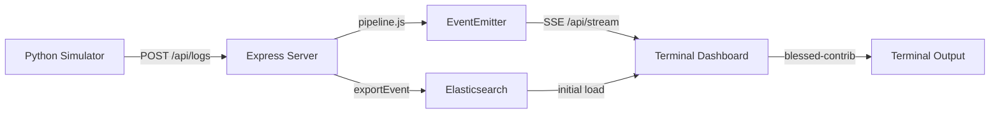

# CLI Terminal Telemetry Dashboard for ULPF

Add a real-time terminal-based dashboard (`cli-dashboard/`) that visualizes ULPF's structured log output in a TUI (Terminal User Interface). This gives the demo video a second presentation layer alongside Kibana — proving ULPF's output is consumption-agnostic.

## Architecture Decision: SSE + `blessed-contrib` TUI

Two approaches were considered:

| Approach | Pros | Cons |
|----------|------|------|
| **A: Poll Elasticsearch** | No server changes | 1-2s latency, extra ES load |
| **B: Server-Sent Events (SSE)** | Truly real-time, lightweight | Minor server change (add emitter + endpoint) |

**Recommendation: Approach B (SSE)** — adds a lightweight `EventEmitter` to the pipeline that broadcasts events as they flow through. The terminal dashboard subscribes to an SSE endpoint for instant updates. For historical aggregations (counts, charts), it also queries Elasticsearch on startup.



## Proposed Changes

### Server-Side: Event Streaming

#### [NEW] [event-bus.js](file:///C:/Users/shahb/SIH-26156/modules/event-bus.js)
A shared singleton `EventEmitter` that the pipeline emits to:
```js
import { EventEmitter } from "node:events";
const bus = new EventEmitter();
bus.setMaxListeners(50);
export default bus;
```

#### [MODIFY] [pipeline.js](file:///C:/Users/shahb/SIH-26156/modules/pipeline.js)
Import `bus` and emit events at each outcome point:
- After **export**: `bus.emit("event", { type: "exported", event_id, source, normalized })`
- After **quarantine**: `bus.emit("event", { type: "quarantined", event_id, reason, raw_preview })`
- After **dead-letter**: `bus.emit("event", { type: "dead-letter", event_id, error })`

This is ~6 lines of code added. Zero impact on existing functionality.

#### [NEW] [stream.js](file:///C:/Users/shahb/SIH-26156/routes/stream.js)
SSE endpoint `GET /api/stream`:
```js
// Sets Content-Type: text/event-stream
// Subscribes to bus events
// Sends each event as SSE `data: JSON.stringify(event)\n\n`
// Cleans up listener on client disconnect
```

#### [MODIFY] [server.js](file:///C:/Users/shahb/SIH-26156/server.js)
Add one line: `app.use("/api/stream", createStreamRouter())`

---

### Terminal Dashboard

#### [NEW] [cli-dashboard/dashboard.js](file:///C:/Users/shahb/SIH-26156/cli-dashboard/dashboard.js)
~250-300 lines. The main TUI application using `blessed` + `blessed-contrib`:

**Layout (4-panel grid):**
```
┌─────────────────────────────────┬──────────────────────┐
│  LIVE EVENT FEED (scrolling)    │  THROUGHPUT GAUGE     │
│  Table: Time | Source | Action  │  Events/sec donut     │
│  | Status | Event ID            │                       │
├─────────────────────────────────┼──────────────────────┤
│  SOURCE DISTRIBUTION            │  STATUS BREAKDOWN     │
│  Bar chart: Cisco/Forti/CEF/Unk │  Donut: Exported/     │
│                                 │  Quarantined/DeadLtr  │
├─────────────────────────────────┴──────────────────────┤
│  ⚠ QUARANTINE ALERTS (blinking, last 5 quarantined)    │
└────────────────────────────────────────────────────────┘
```

**Widgets:**
1. **Live Event Feed** — scrolling log table with color-coded status (green=exported, yellow=quarantined, red=dead-letter)
2. **Throughput Gauge** — rolling events/sec calculated over a 10-second window
3. **Source Distribution** — horizontal bar chart (Cisco ASA / Fortinet / CEF / Unknown)
4. **Status Breakdown** — donut chart showing exported vs quarantined vs dead-letter ratios
5. **Quarantine Alert Strip** — bottom banner that flashes when a quarantine event arrives, showing raw preview

**Data Flow:**
- On startup: fetches aggregate counts from Elasticsearch via `GET /api/events`, `GET /api/quarantine`
- Real-time: subscribes to `http://localhost:3000/api/stream` via `EventSource` (using `eventsource` npm package for Node.js)
- Updates all widgets on each incoming SSE event

#### [NEW] [cli-dashboard/README.md](file:///C:/Users/shahb/SIH-26156/cli-dashboard/README.md)
Usage instructions:
```bash
# Terminal 1: Framework + Kibana running
node server.js

# Terminal 2: Terminal Dashboard
node cli-dashboard/dashboard.js

# Terminal 3: Simulator feeding logs
python log-simulator/simulator.py
```

---

### New Dependencies

| Package | Purpose | Size |
|---------|---------|------|
| `blessed` | Core terminal UI framework | ~400KB |
| `blessed-contrib` | Dashboard widgets (gauges, charts, tables) | ~200KB |
| `eventsource` | Node.js SSE client (EventSource polyfill) | ~15KB |

> [!NOTE]
> These are all well-maintained, zero-native-dependency packages. `blessed-contrib` is the de-facto standard for Node.js terminal dashboards (5K+ GitHub stars).

## User Review Required

> [!IMPORTANT]
> **Color Scheme**: The dashboard will use a dark theme with green/yellow/red status colors to match the "hacker terminal" aesthetic. Should we match Kibana's color palette instead?

> [!IMPORTANT]
> **Demo Video Layout**: For the recording, I suggest a 3-pane screen layout:
> - Left: Terminal Dashboard (this new tool)
> - Top Right: Kibana Dashboard
> - Bottom Right: Python Simulator output
>
> Does this layout work for you?

## Open Questions

1. **Refresh rate**: Should the throughput gauge show events/sec averaged over 5 seconds or 10 seconds? (10s recommended for smoother numbers during demo)
2. **Header/branding**: Should the dashboard header show "ULPF Terminal Telemetry" with the SIH-26156 project ID, or just "ULPF Live Monitor"?
3. **Sound effects**: `blessed` supports terminal bell on quarantine events — useful for demo video or too distracting?

## Verification Plan

### Automated Tests
```bash
node --test tests/*.test.js
```
Existing 48 tests must continue passing (SSE + event-bus changes are additive only).

### Manual Verification
1. Start the server: `node server.js`
2. Start the dashboard: `node cli-dashboard/dashboard.js`
3. Run simulator: `python log-simulator/simulator.py`
4. Verify:
   - Events appear in real-time in the feed table
   - Throughput gauge updates with each batch
   - Source distribution bars grow proportionally
   - Status donut reflects correct ratios
   - Quarantine alerts flash when unknown logs arrive
5. Press `q` or `Escape` to cleanly exit the dashboard
