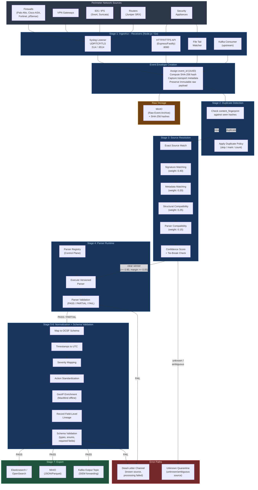
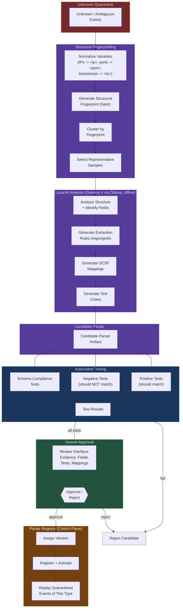
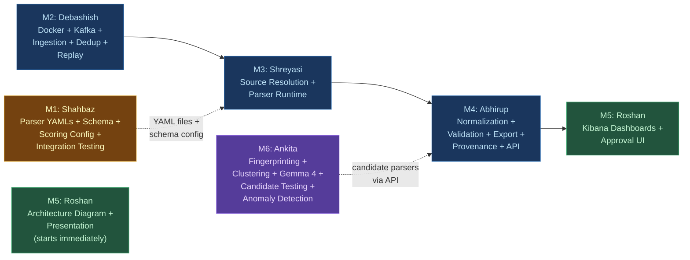

# ULPF Project Blueprint -- SIH 2026 (v2 -- Mentor Reviewed)

> **PS Number**: SIH26156
> **Title**: Universal Log Pre-processing Framework
> **Organization**: National Technical Research Organisation (NTRO)
> **Category**: Software | **Theme**: Miscellaneous

---

## 1. Problem Statement Summary

Modern enterprises generate massive volumes of logs from diverse sources (firewalls, routers, IDS/IPS, VPN gateways, security appliances) in varied formats (Syslog, JSON, CSV, CEF, LEEF, key-value, proprietary vendor formats). This diversity creates major challenges in centralized monitoring, security operations, compliance, incident investigation, and threat analytics. Security teams spend enormous effort building source-specific parsers before data can be used by SIEM, data lakes, or ML platforms.

**Goal**: Build a Universal Log Pre-processing Framework (ULPF) that ingests logs from any perimeter network device in any format, parses and normalizes them into a unified OCSF-aligned schema without losing the original data, and outputs analytics-ready structured data for SIEM, data lake, and ML consumption. The framework must be scalable, extensible, vendor-agnostic, air-gapped deployable, and containerized.

### Core Architectural Identity

> **ULPF is a lossless, deterministic, provenance-aware, and self-extending security event processing framework for heterogeneous perimeter network devices.**

Five non-negotiable principles:

1. **Never lose the original event.**
2. **Never silently misclassify an event.**
3. **Known events are processed deterministically.**
4. **Every important transformation must be traceable.**
5. **AI may assist onboarding, but never directly becomes production truth.**

### Requirements Checklist

| ID | Requirement | Our Approach |
|----|-------------|--------------|
| a | Preserve complete raw event data | Immutable `raw` payload in event envelope + SHA-256 integrity hash + MinIO archival |
| b | Extract source-specific attributes | Versioned plugin parsers with YAML definitions + parser-level validation |
| c | Normalize fields to common taxonomy | OCSF-aligned unified schema with schema-level validation |
| d | Traceability between normalized and raw | Field-level lineage tracing every normalized field back to its raw fragment and extraction rule |
| e | Plug-and-play onboarding of new sources | Drop YAML parser file + AI-assisted candidate generation with automated testing and human approval |
| f | Unified visibility across enterprise | Kibana dashboards, single-pane-of-glass |
| g | SIEM and Data Lake integration | JSON/Parquet output, Kafka forwarding, export adapters |
| h | AI/ML-ready analytics | Consistent schema, Parquet export, anomaly detection |
| i | Reduced parser development effort | YAML definitions + Gemma 4 candidate parser generation with structural clustering |
| j | Air-gapped deployment | All components containerized, offline AI model, no internet |
| k | Container packaging | Docker Compose (single-node), Helm chart (Kubernetes) |

---

## 2. Three-Plane Architecture

The system is logically divided into three planes:

```
+-----------------------------------------------------------+
|                      CONTROL PLANE                        |
|                                                           |
|  Parser Registry . Schemas . Policies . Tests . Config    |
+-----------------------------------------------------------+

+-----------------------------------------------------------+
|                       DATA PLANE                          |
|                                                           |
|  Ingest > Resolve > Parse > Validate > Normalize > Export |
+-----------------------------------------------------------+

+-----------------------------------------------------------+
|                   INTELLIGENCE PLANE                      |
|                                                           |
|  Unknown Logs > Cluster > Local AI > Candidate Parser     |
+-----------------------------------------------------------+
```

- The **Data Plane** is the fast, deterministic, high-throughput processing path. No AI calls happen here.
- The **Intelligence Plane** is deliberately isolated from normal processing. It handles unknown log onboarding asynchronously.
- The **Control Plane** manages parser registry, schema definitions, routing policies, thresholds, and test corpora.

---

## 3. Solution Overview

### 3.1 ULPF Event Envelope

Every event, immediately after ingestion, is wrapped in an **Event Envelope**. This is the core data structure that travels through the entire pipeline.

```json
{
  "event_id": "uuid-v4",
  "content_fingerprint": "sha256-of-raw-payload",
  "received_at": "2026-08-24T10:00:00.000Z",

  "raw": {
    "immutable_payload": "<original log exactly as received, base64 if binary>",
    "encoding": "utf-8",
    "integrity_hash": "sha256:abc123..."
  },

  "transport": {
    "receiver": "syslog_tcp",
    "protocol": "tcp",
    "remote_address": "192.168.1.1:41523",
    "port": 514,
    "metadata": {}
  },

  "source": {
    "type": "cisco_asa",
    "resolution_method": "signature_match",
    "resolution_confidence": 0.96,
    "resolution_evidence": {
      "signature_score": 0.40,
      "metadata_score": 0.20,
      "structural_score": 0.25,
      "compatibility_score": 0.11
    }
  },

  "parsed": {
    "parser_id": "cisco-asa-parser",
    "parser_version": "1.2.0",
    "fields": {
      "src_ip": "10.0.0.5",
      "dst_ip": "203.0.113.10",
      "dst_port": 443,
      "action": "Built inbound"
    },
    "validation_status": "PASS",
    "validation_errors": []
  },

  "normalized": {
    "event_class": "network_activity",
    "event_type": "traffic",
    "timestamp": "2026-08-24T09:59:58.000Z",
    "src_endpoint": { "ip": "10.0.0.5" },
    "dst_endpoint": { "ip": "203.0.113.10", "port": 443 },
    "severity": 1,
    "severity_label": "informational",
    "action": "allowed",
    "disposition": "success",
    "schema_validation_status": "PASS"
  },

  "extensions": {
    "vendor_cisco": {
      "asa_message_id": "ASA-6-302013"
    }
  },

  "enrichment": {
    "geo_src": { "country": "India", "city": "Delhi" },
    "geo_dst": { "country": "US", "city": "Ashburn" }
  },

  "provenance": [
    {
      "stage": "ingest",
      "component": "syslog-receiver",
      "component_version": "1.0.0",
      "timestamp": "2026-08-24T10:00:00.001Z",
      "status": "success"
    },
    {
      "stage": "resolve",
      "component": "source-resolver",
      "component_version": "1.0.0",
      "timestamp": "2026-08-24T10:00:00.005Z",
      "status": "success",
      "result": { "selected_parser": "cisco-asa-parser", "confidence": 0.96 }
    },
    {
      "stage": "parse",
      "component": "cisco-asa-parser",
      "component_version": "1.2.0",
      "timestamp": "2026-08-24T10:00:00.008Z",
      "status": "success"
    },
    {
      "stage": "normalize",
      "component": "ocsf-normalizer",
      "component_version": "1.0.0",
      "timestamp": "2026-08-24T10:00:00.010Z",
      "status": "success"
    }
  ],

  "field_lineage": {
    "normalized.src_endpoint.ip": {
      "raw_fragment": "src=10.0.0.5",
      "parsed_field": "src_ip",
      "extraction_rule": "regex:from\\s+(\\d+\\.\\d+\\.\\d+\\.\\d+)",
      "parser": "cisco-asa-parser",
      "parser_version": "1.2.0",
      "mapping_rule": "src_ip -> normalized.src_endpoint.ip"
    }
  },

  "processing_status": "EXPORTED",
  "processing_state_history": [
    "RECEIVED",
    "RESOLVED",
    "PARSED",
    "NORMALIZED",
    "VALIDATED",
    "EXPORTED"
  ]
}
```

### 3.2 Processing States

Every event explicitly tracks its processing state. The full set of possible states:

| State | Meaning |
|-------|---------|
| `RECEIVED` | Event ingested and raw payload preserved |
| `RESOLVED` | Source identified with clear parser winner |
| `AMBIGUOUS` | Multiple parsers scored close, quarantined |
| `UNKNOWN_SOURCE` | No parser matched, quarantined |
| `PARSED` | Fields successfully extracted |
| `PARTIALLY_PARSED` | Some fields extracted, some failed |
| `FAILED_PARSE` | Parser execution failed, sent to dead-letter |
| `NORMALIZED` | Fields mapped to OCSF schema |
| `FAILED_VALIDATION` | Schema validation failed |
| `QUARANTINED` | Event held for review (unknown or ambiguous) |
| `EXPORTED` | Successfully written to output destinations |

A state transition history is retained in every event, preventing the system from hiding failures behind a generic error.

---

## 4. Data Plane: Pipeline Stages

The Data Plane is the deterministic, fast processing path. It consists of 7 stages.

### Stage 1: Ingestion (Receivers)

Receives events without interpreting them. Receivers are responsible for:
- Receiving the event via transport protocol
- Framing individual events (splitting multi-line, etc.)
- Capturing transport metadata (source IP, port, protocol, receiver type)
- Assigning `event_id` (UUID) and `received_at` timestamp
- Computing `content_fingerprint` (SHA-256 of raw payload)
- Preserving the exact original payload immutably

Transport protocols supported:
- Syslog (UDP/TCP/TLS on ports 514 and 6514)
- HTTP/HTTPS REST API endpoint
- File tail (monitors log files on disk)
- Kafka consumer (for upstream Kafka sources)

**Receivers contain zero vendor-specific parsing logic.** The separation of transport from meaning is fundamental.

Raw event is immediately written to MinIO (raw archival) and pushed to the Kafka `raw-events` topic.

### Stage 2: Duplicate Detection

Before further processing, check for duplicate events using `content_fingerprint`:

```
Incoming Event
      |
      v
Check content_fingerprint
      |
  +---+----+
  |        |
 NEW    DUPLICATE
  |        |
  v        v
PROCESS   APPLY DUPLICATE POLICY
```

Duplicate policy options (configurable via Control Plane):
- Ignore duplicates silently
- Mark as duplicate and skip processing
- Count occurrences
- Preserve but avoid duplicate downstream processing

### Stage 3: Source Resolution

Determines which parser, if any, is safe to use. Uses multiple deterministic signals evaluated in order:

1. **Exact Source Match**: Known source identifier, device metadata, explicit vendor/product tag, known receiver binding.
2. **Signature Matching**: Each parser defines known signatures (e.g., `%ASA-` for Cisco, `date=... time=... devname=` for Fortinet, `receive_time,serial,type,...` for Palo Alto).
3. **Metadata Matching**: Syslog hostname, facility, application name, source IP range, port.
4. **Structural Compatibility**: Does the event structure match what the candidate parser expects (key-value, CSV, JSON, etc.)?
5. **Parser Validation Compatibility**: Would the parser's required fields be extractable from this event?

#### Deterministic Confidence Scoring

Each candidate parser receives a weighted, explainable score:

| Signal | Weight |
|--------|--------|
| Signature Match | 0.40 |
| Metadata Match | 0.20 |
| Structural Compatibility | 0.25 |
| Compatibility Validation | 0.15 |

Weights are configurable defaults via the Control Plane, not hardcoded mathematical truth.

#### Routing Thresholds

| Confidence | Decision |
|------------|----------|
| >= 0.90 | Strong candidate |
| 0.70 to 0.89 | Weak/uncertain candidate |
| < 0.70 | Unknown |

#### Tie-Break and Ambiguity Policy

A high score alone is not enough. The system also checks for ambiguity:

```
Rule:
  Highest score >= routing threshold
  AND
  Highest score - second highest score >= winner margin (default: 0.05)

If both conditions met: CLEAR WINNER -> proceed to parsing
If not: AMBIGUOUS -> QUARANTINE (do not silently pick one)
```

**Core principle: Ambiguity must never become silent misclassification.**

Routing outcomes:
- **Clear winner**: event proceeds to the parser runtime
- **Ambiguous**: event goes to Unknown Quarantine (Intelligence Plane)
- **Unknown**: event goes to Unknown Quarantine (Intelligence Plane)

### Stage 4: Parser Runtime

Executes a versioned parser artifact from the Parser Registry. Parsers support:
- Regex extraction
- Grok-style patterns
- JSON parsing
- Key-value parsing
- CSV column mapping
- Declarative field mappings

Every parser follows a common contract:

```
INPUT: Raw Event
  |
  v
PARSER (versioned)
  |
  +-- Extracted Fields
  +-- Parsing Metadata
  +-- Parser Version
  +-- Parsing Errors (if any)
```

#### Parser-Level Validation

After extraction, the parser's output is validated:

- Required source fields present?
- Timestamp successfully parsed?
- IP values syntactically valid?
- Expected fields extracted?
- Any unexpected extraction errors?

Results:

| Result | Action |
|--------|--------|
| **PASS** | Proceed to normalization |
| **PARTIAL** | Raw preserved, parsed fields retained, errors recorded, status = `PARTIALLY_PARSED`. Normalization continues only for validated fields. |
| **FAIL** | Event goes to Dead-Letter Channel |

### Stage 5: Normalization

Validated parsed fields are transformed into the OCSF-aligned representation:

- All timestamps converted to UTC ISO 8601
- Severity values mapped to 0-10 integer scale and label (informational, low, medium, high, critical)
- Action values mapped to standard verbs (allowed, denied, dropped, reset, logged)
- Protocol numbers mapped to names (6 to TCP, 17 to UDP)
- IP addresses validated and formatted consistently
- GeoIP enrichment using MaxMind GeoLite2 offline database

Vendor-specific fields that do not map cleanly to OCSF are preserved in `extensions.vendor_name.*`. The system never forces a questionable mapping just to make the schema look complete.

**Field-level lineage** is recorded during normalization: for every normalized field, the system records which raw fragment it came from, which extraction rule was used, which parser version applied, and how it was mapped.

### Stage 6: Schema-Level Validation

After normalization, a second independent validation layer checks the OCSF output:

- Required OCSF fields present
- Correct data types
- Valid enum values
- Valid event category and class
- Schema constraints satisfied

This creates two independent validation guarantees:

```
Parser Validation: "Did we extract the data correctly?"
Schema Validation: "Does the normalized event satisfy the OCSF contract?"
```

Only after schema validation passes is the event considered a **trusted normalized event**.

### Stage 7: Export

Trusted normalized events are written to multiple destinations:

- **Elasticsearch/OpenSearch**: real-time search, alerting, Kibana dashboards
- **MinIO (JSON/Parquet)**: data lake storage, ML pipeline consumption
- **Kafka output topic**: downstream SIEM or other consumers forwarding
- **File output (JSON Lines)**: simple file-based consumption

The core framework remains independent of the destination. Export adapters are pluggable.

### Dead-Letter Channel

Distinct from Unknown Quarantine. The Dead-Letter Channel receives events where:
- The source was **known** (a parser was selected)
- But processing **failed** (parser execution error, validation failure)

Each dead-letter event retains: raw event, parser ID, parser version, error metadata, and replay capability.

> **Unknown Quarantine**: "We don't know what this event is."
> **Dead-Letter Channel**: "We know what this should be, but processing failed."

This distinction is operationally important and must not be conflated.

---

## 5. Intelligence Plane: Self-Extending Parser Onboarding

The Intelligence Plane is deliberately isolated from the Data Plane. It handles unknown/ambiguous events asynchronously and never directly modifies production normalized output.

### 5.1 Unknown Quarantine

Events classified as `UNKNOWN` or `AMBIGUOUS` by the Source Resolver are quarantined:

- Raw event preserved
- Source metadata retained
- Content fingerprint stored
- Occurrence count tracked
- Resolution evidence recorded (why it failed to match)

### 5.2 Structural Fingerprinting and Clustering

Unknown logs are **not** sent one-by-one to the AI. First, variable values are normalized:

```
Original:
  2026-08-25 10:10:01 SRC=10.0.0.5 DST=192.168.1.2 PORT=443

Normalized template:
  <timestamp> SRC=<ip> DST=<ip> PORT=<port>
```

Variable types replaced: IPs to `<ip>`, ports to `<port>`, timestamps to `<timestamp>`, numeric IDs to `<id>`.

A structural fingerprint (hash of the normalized template) is generated. Events with the same fingerprint are clustered together.

Each cluster stores:
- Occurrence count
- Representative samples (diverse examples)
- Observed variations
- Source metadata
- First/last seen timestamps

Only **representative samples** from significant clusters are sent to the Intelligence Plane. This keeps AI usage controlled and efficient.

### 5.3 Local AI Analysis (Gemma 4 via Ollama)

The local Gemma 4 model (quantized 4B, fully offline) receives representative samples and may:
- Identify potential fields
- Analyze event structure
- Suggest field names and types
- Suggest extraction rules (regex patterns)
- Generate candidate OCSF field mappings
- Generate test cases

**The AI must NOT:**
- Directly alter production normalized events
- Directly activate itself as a parser
- Modify active parsers without review
- Bypass deterministic validation

> **Core rule: AI proposes. Deterministic systems validate. Humans approve.**

### 5.4 Candidate Parser Generation

AI output becomes a candidate parser artifact:

```
Candidate Parser
|
+-- Detection Rule (signature)
+-- Extraction Rules (regex/grok patterns)
+-- Proposed Fields
+-- Proposed OCSF Mappings
+-- Example Outputs
+-- Generated Test Cases
```

The candidate is NOT active. Its lifecycle:

```
GENERATED -> TESTING -> PASS/FAIL
                          |
                     FAIL: REJECT
                     PASS: HUMAN REVIEW
                              |
                         REJECT or APPROVE
                                    |
                               VERSIONED ACTIVE PARSER
```

### 5.5 Candidate Testing

Before human review, the candidate parser is automatically tested:

**Extraction tests**: expected fields exist, correct values extracted, no invalid values.

**Structural tests**: handles variations, fails safely, does not incorrectly match unrelated events.

**Schema tests**: normalized output satisfies OCSF constraints.

**Negative testing** (critical): the parser must NOT match unrelated log types.

```
Example:
  Cisco ASA parser candidate
  |
  +-- 100 Cisco ASA logs -> SHOULD MATCH
  |
  +-- 100 unrelated logs -> SHOULD NOT MATCH
```

This reduces false-positive parser activation.

### 5.6 Human Approval Workflow

The approval interface exposes:
- Cluster evidence (size, first seen, source metadata)
- Proposed fields and extraction rules
- Positive test results (X/Y passed)
- Negative test results (X/Y correctly rejected)
- Proposed OCSF mappings
- Sample input/output pairs

On approval:
- Version number assigned
- Parser registered in Parser Registry
- Parser activated for future events matching its detection signatures
- Quarantined events of this type can be replayed through the new parser

---

## 6. Control Plane

The Control Plane manages framework behavior and is read by the Data Plane at runtime.

```
+-------------------------------------+
|           CONTROL PLANE             |
+-------------------------------------+
| Parser Registry (all versions)      |
| Detection Signatures per parser     |
| Routing Thresholds (configurable)   |
| Winner Margin (configurable)        |
| Duplicate Policy                    |
| Validation Policies                 |
| OCSF Schema Definitions             |
| Test Corpus (positive + negative)   |
| Candidate Approval Queue            |
| System Configuration                |
+-------------------------------------+
```

### Parser Registry

Each parser in the registry contains:

| Field | Description |
|-------|-------------|
| `parser_id` | Unique identifier |
| `version` | Semantic version, immutable per version |
| `device_family` | e.g., Cisco, Fortinet, Palo Alto |
| `supported_sources` | Source types this parser handles |
| `detection_signatures` | Patterns used during source resolution |
| `parsing_strategy` | regex, grok, json, kv, csv |
| `field_extraction_rules` | Extraction patterns and mappings |
| `normalization_mappings` | Parsed field to OCSF field mappings |
| `validation_rules` | Required fields, type checks |
| `test_cases` | Positive and negative test samples |
| `status` | CANDIDATE / TESTING / APPROVED / ACTIVE / DEPRECATED |

Parser versions are immutable. A modification creates a new version (e.g., v1.0 to v1.1), never silently changes v1.0.

### Replay Architecture

Because raw events are preserved and parser versions are tracked:

```
OLD RAW EVENTS -> SELECT RANGE -> SELECT NEW PARSER VERSION -> REPLAY
-> REPROCESS -> COMPARE OUTPUT
```

Use cases: parser bug fixed, improved extraction, new normalized field, schema evolution, historical investigation.

Replay produces new processing results rather than overwriting historical provenance, preserving auditability.

---

## 7. Architecture Diagram

### Loop 1: Deterministic Event Processing (Data Plane)



### Loop 2: Self-Extending Parser Onboarding (Intelligence Plane)



---

## 8. Storage Architecture

ULPF logically manages four data categories. For the SIH prototype, these are logical responsibilities and can share underlying infrastructure.

| Store | Contents | Technology | Used For |
|-------|----------|------------|----------|
| **Raw Event Store** | Immutable raw payload, integrity hash, event metadata | MinIO (S3-compatible) | Forensics, replay, compliance, reprocessing |
| **Processed Event Store** | Parsed data, normalized event, processing state, provenance | Elasticsearch / OpenSearch | Search, analytics, correlation, visualization |
| **Provenance Store** | Transformation history, component versions, field lineage, errors | Elasticsearch (same index or separate) | Audit trail, debugging, compliance |
| **Parser Registry Store** | Parser artifacts, versions, tests, status, config | Filesystem (YAML files) + API | Parser management, versioning, lifecycle |

---

## 9. Tech Stack

| Layer | Technology | Purpose |
|-------|-----------|---------|
| **Core Pipeline** | Node.js (Express/Fastify) | Receivers, source resolution, parser runtime, normalization, export |
| **Ingestion (optional)** | Go | High-performance Syslog listener (if needed) |
| **AI/ML** | Python 3.12 | Gemma 4 integration, anomaly detection, candidate parser testing |
| **LLM** | Gemma 4 (4B quantized) via Ollama | Offline candidate parser generation for unknown sources |
| **Message Bus** | Apache Kafka + Zookeeper | Buffering, replay, backpressure, stage-to-stage communication |
| **Raw Storage** | MinIO (S3-compatible) | Raw event archival with integrity hashes, works air-gapped |
| **Search/Index** | Elasticsearch 8.x or OpenSearch | Normalized event indexing, full-text search, aggregations, provenance |
| **Visualization** | Kibana or OpenSearch Dashboards | Dashboards, event timeline, search UI, parser approval UI |
| **GeoIP** | MaxMind GeoLite2 (offline DB) | IP-to-location enrichment without internet |
| **Anomaly Detection** | scikit-learn (Isolation Forest) | Lightweight ML on normalized data, no GPU needed |
| **API** | Express or Fastify (Node.js) | Health checks, parser management, log submission, approval workflow |
| **Containerization** | Docker + Docker Compose | Single-command deployment |
| **Orchestration** | Kubernetes + Helm (optional) | Production-scale deployment |
| **Parser Definitions** | YAML files (versioned) | Declarative, no-code parser configuration |

---

## 10. Pre-built Parsers

Focused on perimeter network devices as per the problem statement's current scope:

| # | Parser | Device Family | Format |
|---|--------|---------------|--------|
| 1 | Palo Alto Networks (traffic, threat, system) | Firewall | CSV-like |
| 2 | Cisco ASA | Firewall | Syslog + key-value |
| 3 | Fortinet FortiGate | Firewall | Key-value |
| 4 | Juniper SRX | Firewall/Router | Structured syslog |
| 5 | pfSense | Firewall | Syslog |
| 6 | Snort/Suricata IDS alerts | IDS/IPS | JSON / fast.log |
| 7 | Generic CEF | Multi-vendor | CEF format |
| 8 | Generic LEEF | Multi-vendor | LEEF format |
| 9 | Generic Syslog | Multi-vendor | RFC 3164/5424 |
| 10 | Generic JSON | Any | JSON auto-extract |
| 11 | Generic CSV | Any | Configurable columns |
| 12 | Generic Key-Value | Any | key=value pairs |

---

## 11. Benchmarking and Observability

The prototype includes a benchmark harness and reports real measured metrics:

| Metric | Description |
|--------|-------------|
| Events processed | Total count |
| Events/second | Throughput |
| p50 latency | Median processing time |
| p95 latency | Tail latency |
| Parse success rate | % of events successfully parsed |
| Schema validation success | % passing OCSF validation |
| Unknown-source rate | % quarantined as unknown |
| Dead-letter count | Known sources that failed processing |
| Duplicate count | Events deduplicated |

> [!IMPORTANT]
> Report only real measured numbers from actual test runs. Never invent metrics for the presentation.

---

## 12. Team Members and Role Assignment

### Team Roster

| # | Name | Core Skills |
|---|------|------------|
| M1 | **Shahbaz** (Team Lead) | AI-assisted development, tech understanding, coordination |
| M2 | **Debashish** | Open source, Cloud, DevOps, Go, Node.js, Kafka |
| M3 | **Shreyasi** | MERN stack, strong Node.js backend |
| M4 | **Abhirup** | Fullstack MERN |
| M5 | **Roshan** | Designer, Frontend, Figma, Video editing |
| M6 | **Ankita** | DSA, Python |

### Work Distribution

#### M1: Shahbaz (Team Lead + Parser Author + Integration)

- Overall architecture decisions and system integration
- Write all 12 YAML parser definitions using AI tools (feed sample logs, generate regex patterns, field mappings, OCSF mapping rules, and test cases per parser)
- Define the OCSF-aligned schema (field names, types, enums, required fields)
- Design the confidence scoring weights and routing thresholds for the Control Plane
- Integration testing: feed sample logs end-to-end, verify field-level lineage, check provenance chain
- Write the README with setup instructions
- Help write the architecture document
- Fill gaps wherever anyone is stuck

#### M2: Debashish (Infrastructure + Ingestion + Replay)

- Set up the full Docker Compose stack:
  - Kafka + Zookeeper
  - MinIO
  - Elasticsearch
  - Kibana
  - Ollama (with Gemma 4 model bundled)
- Build the **Ingestion Layer / Receivers** (Node.js or Go):
  - Syslog UDP/TCP/TLS listener (no vendor-specific parsing in receivers)
  - HTTP REST endpoint for log submission
  - File-tail watcher
  - Event envelope creation (UUID, SHA-256 hash, transport metadata)
  - Push to Kafka `raw-events` topic and MinIO raw archive
- Build the **Duplicate Detection** module (content fingerprint checking)
- Kafka topic creation and configuration (raw-events, resolved-events, parsed-events, normalized-events, dead-letter, quarantine)
- Build the **Replay** mechanism (select raw events by range, reprocess through specified parser version)
- Air-gapped deployment script (`docker save`/`docker load`)
- Helm chart (if time permits)

#### M3: Shreyasi (Source Resolution + Parser Engine)

- Build the **Source Resolution Engine** in Node.js:
  - Consume from `raw-events` Kafka topic (post-dedup)
  - Implement multi-signal confidence scoring (exact match, signature, metadata, structural, compatibility)
  - Configurable weights and routing thresholds from Control Plane config
  - Implement tie-break and ambiguity policy (winner margin check)
  - Route clear winners to `resolved-events`, unknowns/ambiguous to `quarantine` topic
- Build the **Parser Runtime** in Node.js:
  - Load versioned parser definitions from `parsers/` directory
  - Apply extraction rules (regex, Grok, JSON path, KV, CSV) based on resolved parser
  - Implement parser-level validation (PASS / PARTIAL / FAIL)
  - Route FAIL events to dead-letter topic
  - File watcher for hot-reloading new/updated parser versions
  - Push parsed events to `parsed-events` topic

#### M4: Abhirup (Normalization + Validation + Export + API)

- Build the **Normalization Engine** in Node.js:
  - OCSF field mapping using parser-defined mapping rules
  - Timestamp normalization to UTC ISO 8601
  - Severity mapping to 0-10 scale
  - Action verb standardization
  - GeoIP enrichment using `maxmind` Node.js library with GeoLite2 offline DB
  - **Field-level lineage recording** (for each normalized field: raw fragment, parsed field, extraction rule, parser ID/version, mapping rule)
  - Vendor-specific unmapped fields preserved in `extensions.vendor_name.*`
- Build the **Schema Validation** module:
  - Validate normalized output against OCSF schema (required fields, types, enums)
  - Route FAIL to dead-letter, PASS to export
- Build the **Export Layer** in Node.js:
  - Write to Elasticsearch (using `@elastic/elasticsearch` client)
  - Write to MinIO as JSON files
  - Forward to Kafka output topic
- Build the **Processing State Tracker** (state history on every event)
- Build the **Provenance Recorder** (stage, component, version, timestamp, status per stage)
- Build the **API Layer** (Express/Fastify):
  - `GET /health` -- pipeline health check
  - `GET /stats` -- ingestion, parsing, validation statistics, dead-letter/quarantine counts
  - `GET /parsers` -- list parsers with versions and status
  - `POST /parsers` -- upload new YAML parser file (enters as CANDIDATE)
  - `POST /parsers/:id/approve` -- approve candidate parser
  - `POST /logs` -- manually submit a log for processing
  - `GET /events/:id/lineage` -- get field-level lineage for an event
  - `POST /replay` -- trigger replay of raw events through a specified parser version

#### M5: Roshan (Design + Dashboards + Approval UI + Demo)

- Design the **architecture diagram** in Figma (clean, professional, showing both loops)
- Set up **Kibana dashboards**:
  - Event timeline (time-series visualization)
  - Source distribution (pie chart)
  - Severity breakdown (bar chart)
  - Processing state distribution (how many PARSED vs QUARANTINED vs DEAD_LETTER)
  - Parser hit/miss rates
  - Top talkers table
  - Event search with field-level lineage drill-down
  - Quarantine queue view
  - Dead-letter queue view
- Build the **Parser Approval UI** (simple React page or Kibana custom visualization):
  - Show candidate parsers with evidence, proposed fields, test results
  - Approve / Reject buttons
- Create the **demo video** (2 minutes):
  - 0:00-0:25 -- Problem statement and NTRO context
  - 0:25-0:50 -- Architecture walkthrough (two-loop diagram)
  - 0:50-1:20 -- Live demo: 5 sources ingested, Kibana dashboard, click event to see field-level lineage
  - 1:20-1:40 -- Unknown log quarantined, clustered, Gemma 4 generates candidate parser, automated tests pass, human approves, parser activated
  - 1:40-2:00 -- Show replay of quarantined events now parsed correctly + benchmark numbers
- Create the **5-slide technical presentation** (Figma/PowerPoint)
- Project branding: logo, color scheme

#### M6: Ankita (Intelligence Plane + Anomaly Detection)

- Build the **Structural Fingerprinting and Clustering** module in Python:
  - Consume quarantined events
  - Normalize variable values (IPs to `<ip>`, ports to `<port>`, timestamps to `<ts>`, IDs to `<id>`)
  - Generate structural fingerprint (hash of normalized template)
  - Cluster events by fingerprint
  - Track cluster metadata (count, first/last seen, representative samples)
  - Select diverse representative samples from significant clusters
- Build the **Gemma 4 Integration Service** in Python:
  - Flask or FastAPI HTTP server
  - Receive representative samples from a cluster
  - Call local Ollama API with engineered prompts
  - Generate candidate parser artifact: detection signature, extraction rules, proposed OCSF mappings, test cases
  - Return candidate as structured YAML
- Build the **Candidate Parser Testing** module in Python:
  - Run candidate parser against cluster samples (positive tests)
  - Run candidate against unrelated log samples (negative tests)
  - Validate output against OCSF schema
  - Report pass/fail results
- Build the **Anomaly Detection** module in Python:
  - scikit-learn Isolation Forest
  - Periodically query Elasticsearch for recent normalized events
  - Compute anomaly scores on features (event frequency, unusual ports, failed actions, traffic volume)
  - Write anomaly scores back to Elasticsearch
- Write unit tests for all modules

---

## 13. Dependency Order



> [!IMPORTANT]
> M2 must get Docker Compose + Kafka running first. Everything else depends on the infrastructure being up. M6 and M1 work independently in parallel from day one.

---

## 14. Timeline (Assuming 2-3 Weeks Before Internal Round)

### Week 1: Foundation

| Member | Tasks |
|--------|-------|
| M2 | Docker Compose stack fully running (Kafka, ES, Kibana, MinIO, Ollama). Ingestion receivers accepting Syslog and HTTP logs. Event envelope creation with SHA-256. Push to Kafka + MinIO. Duplicate detection. |
| M3 | Source Resolution engine with confidence scoring. Parser Runtime loading YAML files and extracting fields. Parser-level validation (PASS/PARTIAL/FAIL). |
| M4 | Normalization module started (timestamp, severity, action mapping). Field-level lineage recording. Elasticsearch write logic. |
| M6 | Structural fingerprinting and clustering module. Gemma 4 service running locally, tested with 5-6 sample log formats. |
| M1 | OCSF schema definition. Confidence scoring weights config. First 5 parser YAML definitions with test cases. |
| M5 | Architecture diagram (both loops) designed in Figma. Presentation structure drafted. |

### Week 2: Integration

| Member | Tasks |
|--------|-------|
| All | Connect all Data Plane stages end-to-end. Events flow from ingestion through to Elasticsearch with full provenance and lineage. |
| M1 | Remaining 7 parser definitions with positive and negative test cases. Integration testing with sample logs from all sources. |
| M4 | Schema validation layer. Export layer complete. API endpoints working. Processing state tracker. Provenance recorder. |
| M3 | Tie-break/ambiguity policy. Dead-letter routing. Hot-reload tested. |
| M5 | Kibana dashboards set up with live data. Quarantine and dead-letter views. |
| M6 | Candidate parser generation pipeline working end-to-end. Candidate testing with negative tests. Anomaly detection module querying Elasticsearch. |
| M2 | Replay mechanism. Air-gapped deployment script. |

### Week 3: Polish

| Member | Tasks |
|--------|-------|
| M1 | README finalized. Architecture document written. Final integration testing across both loops. |
| M2 | Benchmark harness. Load testing. Real throughput/latency numbers collected. |
| M4 | Parser approval API endpoint. Event lineage API endpoint. |
| M5 | Parser approval UI. Demo video recorded and edited. Presentation finalized. |
| M6 | Unit tests finalized. Candidate testing hardened. |
| All | Dry run of presentation. Bug fixes. Final demo rehearsal. |

---

## 15. Deliverables Checklist

- [ ] **GitHub Repository** with clean structure
- [ ] **README.md** with `docker-compose up` setup instructions
- [ ] **Architecture Document** (2-page PDF)
- [ ] **Demo Video** (2-minute MP4)
- [ ] **Technical Presentation** (5 slides)

### Repository Structure

```
ulpf/
├── docker-compose.yml
├── README.md
├── docs/
│   ├── architecture.pdf
│   └── presentation.pptx
├── config/
│   ├── schema.json          (OCSF schema definition)
│   ├── scoring.yaml         (confidence weights, thresholds, margins)
│   └── policies.yaml        (duplicate policy, validation policies)
├── ingestion/               (M2 - Node.js/Go)
│   ├── receivers/
│   ├── envelope/
│   └── dedup/
├── source-resolver/         (M3 - Node.js)
├── parser-engine/           (M3 - Node.js)
├── parsers/                 (M1 - YAML definitions, versioned)
│   ├── cisco_asa_v1.0.yaml
│   ├── palo_alto_v1.0.yaml
│   ├── fortinet_v1.0.yaml
│   └── ... (12 total)
├── normalizer/              (M4 - Node.js)
│   ├── ocsf-mapper/
│   ├── field-lineage/
│   └── enrichment/
├── validator/               (M4 - Node.js)
│   ├── parser-validator/
│   └── schema-validator/
├── provenance/              (M4 - Node.js)
├── export/                  (M4 - Node.js)
├── api/                     (M4 - Node.js)
├── intelligence/            (M6 - Python)
│   ├── fingerprinting/
│   ├── clustering/
│   ├── gemma4-service/
│   ├── candidate-generator/
│   └── candidate-tester/
├── ml/                      (M6 - Python)
│   └── anomaly-detection/
├── replay/                  (M2 - Node.js)
├── dashboards/              (M5 - Kibana exports)
├── approval-ui/             (M5 - React, optional)
├── sample-logs/             (test data)
├── test-corpus/             (positive + negative test samples per parser)
├── benchmark/               (M2 - load generator + metrics collector)
└── scripts/                 (M2 - setup, air-gapped installer)
```

---

## 16. Key Differentiators (What Makes Us Stand Out)

1. **Three-Plane Architecture**: Clean separation of Data Plane (fast, deterministic), Intelligence Plane (AI-assisted, async), and Control Plane (policy-driven). Shows mature systems thinking.

2. **Never Silently Misclassify**: Deterministic confidence scoring with explicit ambiguity/tie-break policy. Unknown and ambiguous events are quarantined, not guessed. NTRO judges will appreciate this security-first approach.

3. **Field-Level Lineage**: Every normalized field traces back to its exact raw fragment, extraction rule, parser version, and mapping rule. Goes far beyond simple event-level traceability. Critical for forensics and compliance.

4. **Self-Extending via Controlled AI**: Gemma 4 generates candidate parsers, but they must pass automated testing (including negative tests) and human approval before activation. "AI proposes, deterministic systems validate, humans approve."

5. **Two Independent Validation Layers**: Parser validation ("did we extract correctly?") and schema validation ("does it satisfy the OCSF contract?") are separate guarantees. Prevents bad data from silently entering the analytics pipeline.

6. **Replay Architecture**: Raw events can be reprocessed through new parser versions for historical investigation, bug fixes, or schema evolution. Provenance is preserved, not overwritten.

7. **Fully Air-Gapped**: Every component runs offline in containers. No API keys, no cloud dependencies, no internet. Directly addresses NTRO's operational environment.

8. **Real Benchmark Numbers**: Measured throughput, latency percentiles, parse success rates, and validation metrics from actual test runs. No invented claims.

---

## 17. Demo Strategy (2-Minute Video)

| Time | Content |
|------|---------|
| 0:00 - 0:25 | Problem statement: show 5 different log formats side by side, explain the chaos, mention NTRO context |
| 0:25 - 0:50 | Architecture walkthrough: two-loop diagram, explain Data Plane vs Intelligence Plane separation |
| 0:50 - 1:20 | **Live Demo Loop 1**: Feed logs from 5 perimeter devices simultaneously. Show Kibana dashboard updating in real-time. Click a normalized event, show provenance chain and field-level lineage tracing back to raw. |
| 1:20 - 1:40 | **Live Demo Loop 2**: Send an unknown log format. Show it quarantined. Show structural clustering. Gemma 4 generates candidate parser. Automated tests pass (positive + negative). Human clicks "Approve." Parser activated. Quarantined events replayed and now appear parsed in Kibana. |
| 1:40 - 2:00 | Show benchmark results (real numbers). Show adding a new parser by dropping YAML file. Closing statement. |
